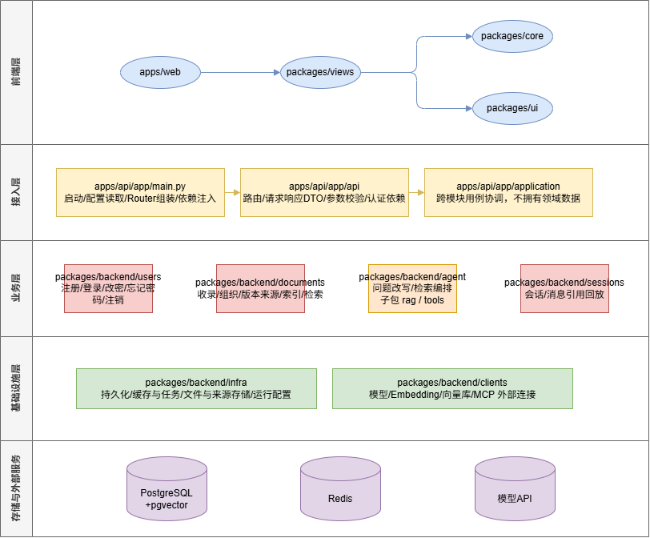

# 架构文档

## 1. 架构目标

- 让知识收录、检索、问答和来源追溯各自有清晰边界。
- 让 React 前端、FastAPI 后端和基础设施彼此分离。
- 让模块可以通过接口联动，但不能把别的模块业务复制到自己目录。
- 让文档版本、来源快照、会话引用和回答结果形成可追溯链路。
- 让会话运行能够在断线或进程重启后恢复。
- 让检索结果经过过滤、重排和证据判断后再进入模型上下文。
- 让一个功能能够定位到一个领域模块、一个 Issue 和一个 Pull Request。

本文说明模块怎么分、边界在哪、目录怎么放，以及模块之间怎么联动。具体模块内部设计见 `docs/modules/`。

## 2. 架构图与目录划分

架构图使用 draw.io 维护，源文件是 `docs/diagrams/architecture.drawio`，导出文件是 `docs/diagrams/architecture.png`。业务流程使用文字或 flowchart 表达，不塞进架构图。

代码目录划分如下：

~~~text
yoyo-knowledge-base/
├── README.md
├── TECH_STACK.md
├── AGENTS.md
├── LICENSE
├── package.json
├── pnpm-workspace.yaml
├── pnpm-lock.yaml
├── pyproject.toml
├── docker-compose.yml
├── .env.example
├── .github/
├── apps/
│   ├── web/
│   └── api/
│       └── app/
│           ├── main.py
│           ├── config.py
│           ├── application/       # 跨模块用例协调，不拥有领域数据
│           └── api/
├── packages/
│   ├── core/
│   ├── ui/
│   ├── views/
│   └── backend/
│       ├── users/
│       │   ├── controller.py
│       │   ├── models.py
│       │   ├── schemas.py
│       │   └── ports.py
│       ├── documents/
│       │   ├── controller.py
│       │   ├── models.py
│       │   ├── schemas.py
│       │   ├── ports.py
│       │   ├── indexing.py
│       │   └── search.py
│       ├── sessions/
│       │   ├── controller.py
│       │   ├── models.py
│       │   ├── schemas.py
│       │   └── ports.py
│       ├── agent/
│       │   ├── controller.py
│       │   ├── models.py
│       │   ├── ports.py
│       │   ├── rag/
│       │   ├── tools/
│       │   └── prompts/
│       ├── clients/
│       │   ├── llm.py
│       │   ├── embeddings.py
│       │   ├── vector_store.py
│       │   └── mcp.py
│       └── infra/
│           ├── db.py
│           ├── cache.py
│           ├── storage.py
│           ├── jobs.py
│           └── migrations/
├── tests/
├── data/
├── scripts/
├── docs/
│   ├── total-design.md
│   ├── architecture.md
│   ├── mvp.md
│   ├── diagrams/
│   └── modules/
└── brand/

目录树说明职责归属；具体文件在对应职责进入实现时创建，不提前堆出空模块。`apps/api` 是启动壳，不是新的业务模块；业务真正归属于 `packages/backend` 下的领域包。

## 3. 模块职责与边界

后端领域模块：

| 模块 | 负责 | 不负责 |
| --- | --- | --- |
| 账户（`users`） | 注册、登录、修改密码、忘记密码、注销和当前用户身份 | 不判断某条资料或某个会话该不该被访问 |
| 文档（`documents`） | 资料收录、组织、归档、删除、版本、来源、切分、索引、检索和导出 | 不生成回答，不做问题改写和检索编排 |
| 编排（`agent`） | 问题改写、检索编排、证据判断、上下文组装、回答生成和运行控制 | 不拥有文档、版本、索引和会话消息 |
| 会话（`sessions`） | 会话、消息和回答引用的保存与回放 | 不负责回答策略、过程事件、取消和重连恢复 |
| 基础设施（`infra`） | 数据库、缓存、文件、后台任务和基础资源生命周期 | 不做产品业务判断 |

非业务支持包：

- `agent/rag` 是 Agent 的子能力，负责“如何检索和使用知识”；文档内容、版本、切分、索引和检索数据仍归 `documents`。
- `agent/tools` 是适配层，负责工具定义、参数、权限和结果转换；不保存文档，不包办文档检索。
- `agent/prompts` 集中存放系统提示和任务提示，提示词不散落在业务流程中。
- `clients` 只对接外部模型、Embedding、向量库或 MCP；不放个人知识库业务规则。
- `infra` 只提供数据库、缓存、文件、任务等基础能力；不反向依赖领域模块。

前端包：

- `apps/web`：Web 路由、页面入口、Provider、前端环境变量和平台装配。
- `packages/core`：无头业务能力、领域类型、API 客户端和纯逻辑；不依赖 React、DOM 或平台环境变量。
- `packages/ui`：无业务 UI、通用组件、样式和交互基础设施；不依赖 `core`。
- `packages/views`：按业务域组合 `core` 与 `ui` 为页面视图；不读取平台环境变量，不承担平台路由。

## 4. 模块联动与架构约束

### 分层与依赖方向

前端依赖方向固定为：

~~~text
apps/web → packages/views → packages/core
                    ↓
                packages/ui
~~~

`packages/ui` 不反向依赖 `packages/core`。未来如果增加 CLI，只允许依赖 `packages/core`，不能依赖 React 页面和路由层。

后端依赖方向为：

~~~text
apps/api/app/main.py
  → apps/api/app/api
  → apps/api/app/application
  → 各领域模块的 controller
  → 领域内部业务逻辑、领域模型和数据访问
  → 通过 Port 使用 infra / clients 提供的基础能力或外部连接

agent/rag → DocumentSearchPort → documents
应用协调层 → sessions 的消息与引用 Port
documents  → 通过 Port 使用 clients / infra 的检索和存储能力
~~~

- `apps/api/app/main.py` 只创建 FastAPI、挂生命周期和统一装配路由。
- `apps/api/app/api` 是唯一 HTTP 暴露层，只解析请求、校验参数、调用模块 controller 和组装响应。
- `apps/api/app/application` 是跨模块用例协调层，只组合各模块 controller/Port 的调用；它不保存领域数据、不实现 documents、sessions 或 agent 的业务规则，也不直接操作数据库表。
- 每个领域模块通过自己的 controller 作为模块应用入口；controller 不等于 HTTP 路由，也不包办其他模块逻辑。
- controller 只负责把本模块的用例能力装配成稳定的模块入口；跨模块流程由应用协调层组合调用，不由某个模块 controller 代管其他模块业务。
- 应用协调层负责组合一次提问或删除会话所需的模块调用，但不拥有 Session、Run、Message 或 Document 的数据和规则。
- 应用协调层属于 `apps/api` 的装配边界，不是新的业务模块，也不能变成通用 service。
- 领域模块内部维护自己的业务对象、规则、数据访问和对外 Port；同层模块不能通过共享 service 互相深入调用。
- 跨模块联动只传递明确的输入、输出、Port 或事件，不直接修改别的模块内部数据。
- `agent` 只能通过 `DocumentSearchPort` 等显式接口使用 documents 的能力，不直接访问文档数据库或向量库；会话历史由应用协调层读取后作为输入传给 Agent。
- 工具适配层同样通过 `DocumentSearchPort` 调用 documents，不另外定义检索端口；`SearchHit` 到 Agent 内部视图的转换发生在 Agent 侧。
- 检索的“怎么查”（问题改写、检索计划、是否重查、证据判断和上下文选择）属于 `agent`；检索的“怎么算”（切分、索引、权限/版本过滤、召回和候选结果融合）属于 `documents`。
- `clients` 负责外部连接，`infra` 负责基础资源；领域模块通过 Port 使用二者，二者都不决定用户业务状态。
- 不建立通用 `utils`、万能 `services` 或万能 `repository` 包承载跨领域逻辑。
- 领域包不直接依赖 FastAPI 路由对象，也不把 ORM 对象直接作为公开响应。

### 模块联动规则

- 文档编辑产生新的版本，索引只面向最新版本；旧版本和来源快照用于追溯。
- 回答引用由 `agent` 产生，应用协调层调用 `sessions` 保存，始终绑定具体文档版本或来源快照。
- 过程事件、取消、继续和断线恢复属于 `agent` 的运行控制，不放进 `sessions`。
- `sessions` 只保存当前活动 Run 的关联标识，不拥有 Run；删除会话时，应用协调流程先调用 agent 清理运行记录，再按边界调用 sessions 删除会话数据，不能跨模块直接删表。
- 活动 Run 的领取必须是带条件的持久化更新：只有 `active_run_id` 为空时才能写入；创建 Run、领取关联和失败补偿由应用协调用例保证幂等。
- Run 进入 `completed`、`cancelled` 或 `failed` 等终态时，应用协调流程必须清理对应的 `active_run_id`；只有仍可继续的运行状态可以保留关联。
- 工具通过注入的 Port 使用其他模块能力；工具本身不偷偷导入别的模块业务实现。

## 5. 模块联动示例

RAG 是 Agent 的子能力：RAG 负责“如何检索和使用知识”，documents 负责“知识如何保存、切分、索引和被检索”。一次问答的调用链是：

~~~text
用户问题
  ↓
apps/api/app/api：解析请求并取得当前用户
  ↓
apps/api/app/application：保存 User Message
  ↓
agent.controller：创建 queued Run
  ↓
apps/api/app/application：条件领取活动 Run；失败则丢弃 queued Run
  ↓
agent/rag：问题改写与检索计划
  ↓
DocumentSearchPort
  ↓
documents：全文、关键词和向量混合召回、权限/版本过滤、候选融合
  ↓
agent/rag：问题改写、重排、证据判断和上下文组装
  ↓
agent：调用 clients 中的模型连接生成回答
  ↓
apps/api/app/application：调用 sessions 保存 Message 与 Citation，在所有终态清理活动 Run 关联
~~~

用户先注册账号并登录，把一篇网页文章和一份 Markdown 笔记录入知识库，打上标签并归入专题。一周后他新建会话提问，系统同时进行全文和向量召回，融合排序后筛出相关片段。

如果第一次检索的证据不足，Agent 只有限次改写查询并请求 documents 重新检索；仍不足就返回明确的“知识库证据不足”，不让模型编造确定结论。回答完成后，引用绑定当时的文档版本和来源快照。

用户后来修改文档，documents 生成新版本并刷新索引；旧回答仍然可以回到旧版本。提问过程中用户可以取消或继续 Run；如果中途断网，重新进入后按照事件序号补回已经产生的过程。

## 6. 关键取舍

- **为什么使用全文与向量混合检索**：型号、错误码等精确词需要关键词命中，同义表达又需要向量召回；两者结合比只做一种更适合个人资料。
- **为什么 RAG 是 Agent 子包**：问题改写、是否重检索和证据判断都服务于当前这轮问答；独立成业务模块会制造额外的双向依赖。文档切分、索引和检索实现仍归 documents。
- **为什么引用绑定版本和来源快照**：文档会被改写、网页来源也可能失效，只绑定文档本身无法还原历史回答依据。
- **为什么事件先持久化再推送**：流式通知断线会丢失，带序号持久化后才能按缺口回放。
- **借鉴哪些成熟流程**：可恢复工作流借鉴“步骤快照 + 事件回放”，RAG 管道借鉴“写入管道与查询管道分开、召回后过滤重排”，检索评估借鉴“标注问题集 + Recall@K / MRR@K”。这里只借鉴流程思想，不引入完整工作流引擎或 RAG 框架。
- **为什么保留 Python 后端并把业务放入 packages**：当前 Python + FastAPI 已经跑通；`apps/api + packages/backend` 只调整启动壳与业务包归属，不扩大成 TypeScript 全栈迁移。
- **为什么不设全局 `utils`、`services` 或 `repository`**：不知道归属的逻辑一旦集中到万能包，领域边界会迅速失效；跨模块复用应由拥有能力的模块通过 Port 暴露。

## 7. 设计问题回答

### 知识怎么建模和组织，为什么利于检索

资料以“文档 + 版本”建模，正文修改产生新版本；当前版本用于检索，历史版本和来源快照用于追溯。专题、标签和文档关联是可交叉的组织维度，一篇资料可以同时属于专题、带多个标签并关联其他资料。这些维度也可以成为检索过滤条件，先缩小范围再计算相关度。

### 检索链路怎么设计，检索不准时怎么办

应用协调层读取会话历史并交给 Agent。Agent 结合问题和会话上下文改写查询，再通过 `DocumentSearchPort` 请求 documents 做关键词、全文和向量混合召回。documents 负责切分、索引、权限/版本过滤、候选去重和结果融合；Agent 负责重排、证据判断、上下文预算和是否重查。证据门槛不通过时有限次改写和重检索，仍不足则明确返回证据不足。

### Agent 或工作流怎么处理一步答不好的问题

不引入没有必要的多 Agent 层。一次回答由可恢复的 Run 组织；检索证据不足走改写和有限重检索，外部调用失败走有限重试，回答生成后检查 Citation。每个关键步骤先保存快照，再产生事件；断线或进程重启从最近快照继续，无法继续时保留可识别失败状态。

### 怎么评估检索质量

为代表性问题保留期望文档或版本作为小型标注集，检查正确来源是否进入前 `K` 个结果、是否排在更前面、证据门槛是否拦住无依据回答，并记录 `Recall@K`、`MRR@K`、引用命中率和证据不足误判率。MVP 同时记录命中数量、二次检索触发率和失败原因；评估结果用于调整检索策略，不改变 documents 的数据所有权。

第一版功能范围和发布判断统一见 `docs/mvp.md`，本架构文档只说明支撑该范围所需的模块边界和依赖方向。
