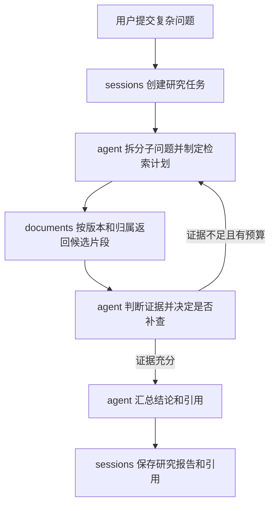

# 深度研究流程

```mermaid
flowchart TD
    A[用户提交复杂问题] --> B[sessions 创建研究任务]
    B --> C[agent 拆分子问题并制定检索计划]
    C --> D[documents 按版本和归属返回候选片段]
    D --> E[agent 判断证据并决定是否补查]
    E -- 证据不足且有预算 --> C
    E -- 证据充分 --> F[agent 汇总结论和引用]
    F --> G[sessions 保存研究报告和引用]
```

研究过程由 agent 编排，研究任务和报告由 sessions 保存；documents 只提供知识，infra 记录模型调用和运行步骤。
