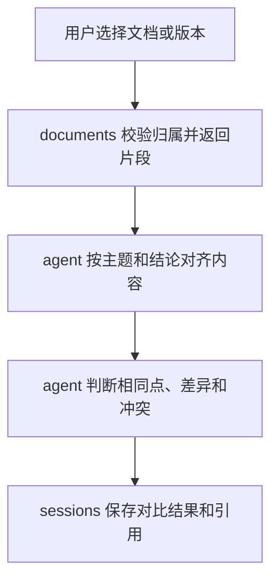

# 文档对比流程

```mermaid
flowchart TD
    A[用户选择文档或版本] --> B[documents 校验归属并返回片段]
    B --> C[agent 按主题和结论对齐内容]
    C --> D[agent 判断相同点、差异和冲突]
    D --> E[sessions 保存对比结果和引用]
```

对比使用指定版本，避免文档更新后历史结果失去依据；agent 负责比较逻辑，sessions 负责结果回放。
