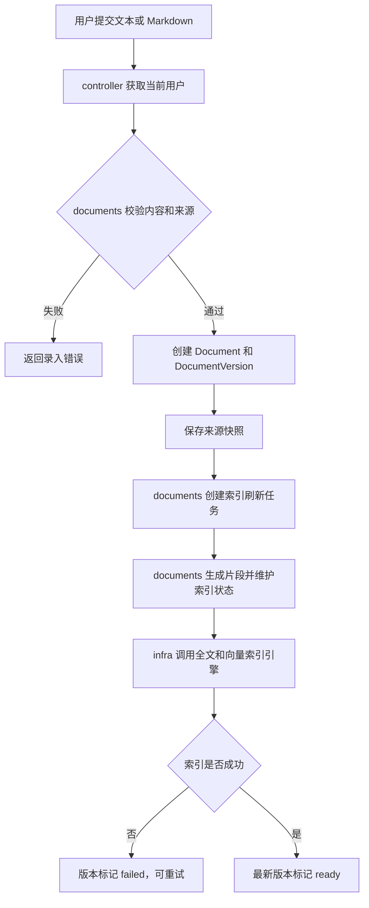

# 文档录入流程

```mermaid
flowchart TD
    A[用户提交文本或 Markdown] --> B[controller 获取当前用户]
    B --> C{documents 校验内容和来源}
    C -- 失败 --> D[返回录入错误]
    C -- 通过 --> E[创建 Document 和 DocumentVersion]
    E --> F[保存来源快照]
    F --> G[documents 创建索引刷新任务]
    G --> H[documents 生成片段并维护索引状态]
    H --> I[infra 调用全文和向量索引引擎]
    I --> J{索引是否成功}
    J -- 否 --> K[版本标记 failed，可重试]
    J -- 是 --> L[最新版本标记 ready]
```

文档元数据、版本和索引状态归 `documents`，来源内容由 `infra` 提供存储能力。
