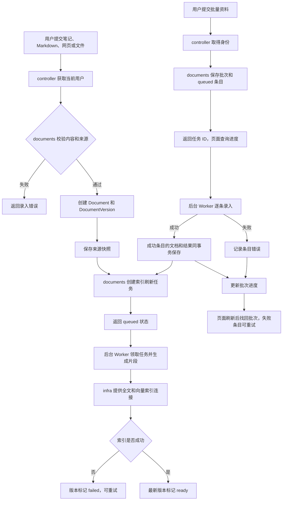

# 文档录入流程

```mermaid
flowchart TD
    A[用户提交笔记、Markdown、网页或文件] --> B[controller 获取当前用户]
    B --> C{documents 校验内容和来源}
    C -- 失败 --> D[返回录入错误]
    C -- 通过 --> E[创建 Document 和 DocumentVersion]
    E --> F[保存来源快照]
    F --> G[documents 创建索引刷新任务]
    G --> H[返回 queued 状态]
    H --> I[后台 Worker 领取任务并生成片段]
    I --> J[infra 提供全文和向量索引连接]
    J --> K{索引是否成功}
    K -- 否 --> L[版本标记 failed，可重试]
    K -- 是 --> M[最新版本标记 ready]
    N[用户提交批量资料] --> O[controller 取得身份]
    O --> P[documents 保存批次和 queued 条目]
    P --> Q[返回任务 ID，页面查询进度]
    Q --> R[后台 Worker 逐条录入]
    R -- 成功 --> U[成功条目的文档和结果同事务保存]
    U --> G
    U --> S[更新批次进度]
    R -- 失败 --> V[记录条目错误]
    V --> S
    S --> T[页面刷新后找回批次，失败条目可重试]
```

文档元数据、版本、批次结果和索引状态归 `documents`，来源内容由 `infra` 提供存储能力。批量任务中每条成功结果与新文档同事务提交，重启后只继续未完成的条目。
