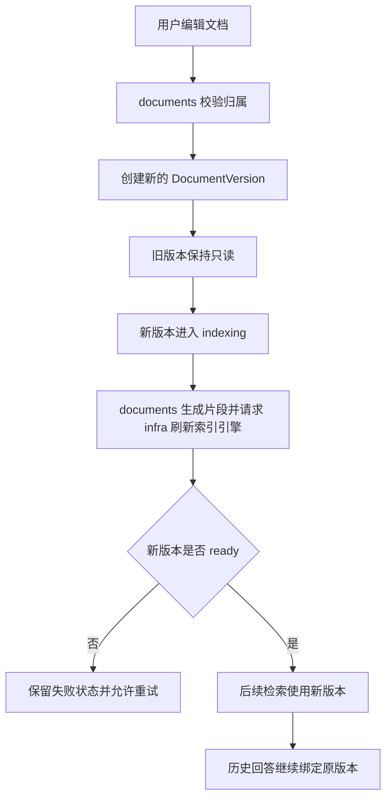

# 文档更新流程

```mermaid
flowchart TD
    A[用户编辑文档] --> B[documents 校验归属]
    B --> C[创建新的 DocumentVersion]
    C --> D[旧版本保持只读]
    D --> E[新版本进入 indexing]
    E --> F[documents 生成片段并请求 infra 刷新索引引擎]
    F --> G{新版本是否 ready}
    G -- 否 --> H[保留失败状态并允许重试]
    G -- 是 --> I[后续检索使用新版本]
    I --> J[历史回答继续绑定原版本]
```
