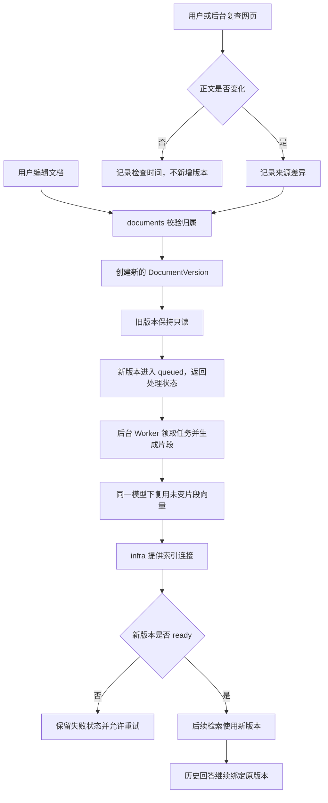

# 文档更新流程

```mermaid
flowchart TD
    A[用户编辑文档] --> B[documents 校验归属]
    S[用户或后台复查网页] --> T{正文是否变化}
    T -- 否 --> U[记录检查时间，不新增版本]
    T -- 是 --> V[记录来源差异]
    V --> B
    B --> C[创建新的 DocumentVersion]
    C --> D[旧版本保持只读]
    D --> E[新版本进入 queued，返回处理状态]
    E --> F[后台 Worker 领取任务并生成片段]
    F --> G[同一模型下复用未变片段向量]
    G --> H[infra 提供索引连接]
    H --> I{新版本是否 ready}
    I -- 否 --> J[保留失败状态并允许重试]
    I -- 是 --> K[后续检索使用新版本]
    K --> L[历史回答继续绑定原版本]
```
