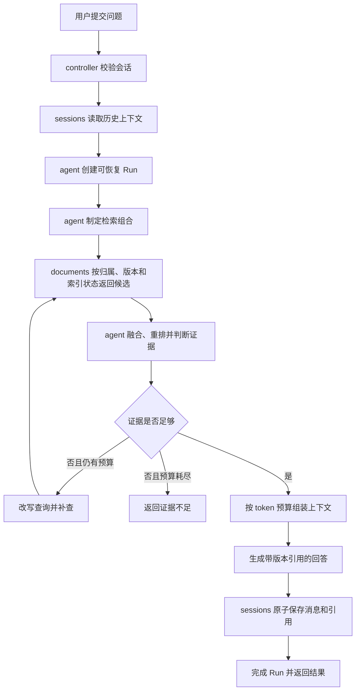

# 问答流程

```mermaid
flowchart TD
    A[用户提交问题] --> B[controller 校验会话]
    B --> C[sessions 读取历史上下文]
    C --> D[agent 创建可恢复 Run]
    D --> E[agent 制定检索组合]
    E --> F[documents 按归属、版本和索引状态返回候选]
    F --> G[agent 融合、重排并判断证据]
    G --> H{证据是否足够}
    H -- 否且仍有预算 --> I[改写查询并补查]
    I --> F
    H -- 否且预算耗尽 --> J[返回证据不足]
    H -- 是 --> K[按 token 预算组装上下文]
    K --> L[生成带版本引用的回答]
    L --> M[sessions 原子保存消息和引用]
    M --> N[完成 Run 并返回结果]
```
