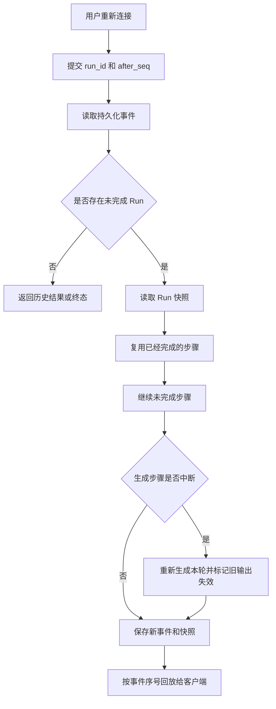

# Agent 运行恢复流程

```mermaid
flowchart TD
    A[用户重新连接] --> B[提交 run_id 和 after_seq]
    B --> C[读取持久化事件]
    C --> D{是否存在未完成 Run}
    D -- 否 --> E[返回历史结果或终态]
    D -- 是 --> F[读取 Run 快照]
    F --> G[复用已经完成的步骤]
    G --> H[继续未完成步骤]
    H --> I{生成步骤是否中断}
    I -- 是 --> J[重新生成本轮并标记旧输出失效]
    I -- 否 --> K[保存新事件和快照]
    J --> K
    K --> L[按事件序号回放给客户端]
```
