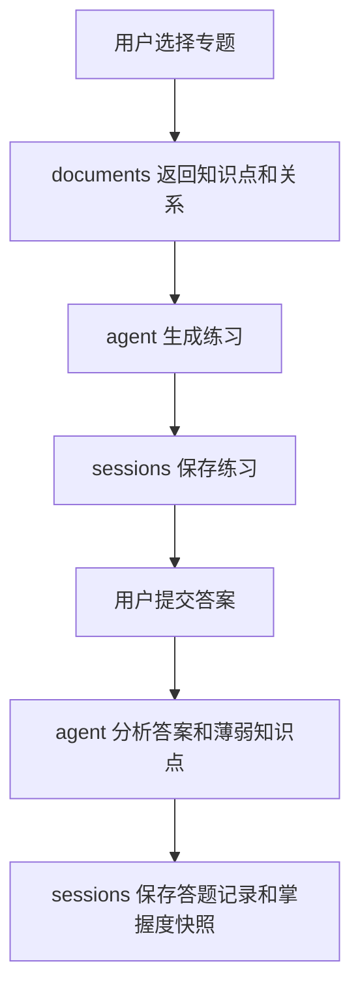

# 学习模式流程

```mermaid
flowchart TD
    A[用户选择专题] --> B[documents 返回知识点和关系]
    B --> C[agent 生成练习]
    C --> D[sessions 保存练习]
    D --> E[用户提交答案]
    E --> F[agent 分析答案和薄弱知识点]
    F --> G[sessions 保存答题记录和掌握度快照]
```

学习模式使用已有知识生成练习，不把练习规则写入 documents；后续复习根据 sessions 保存的掌握度选择内容。
